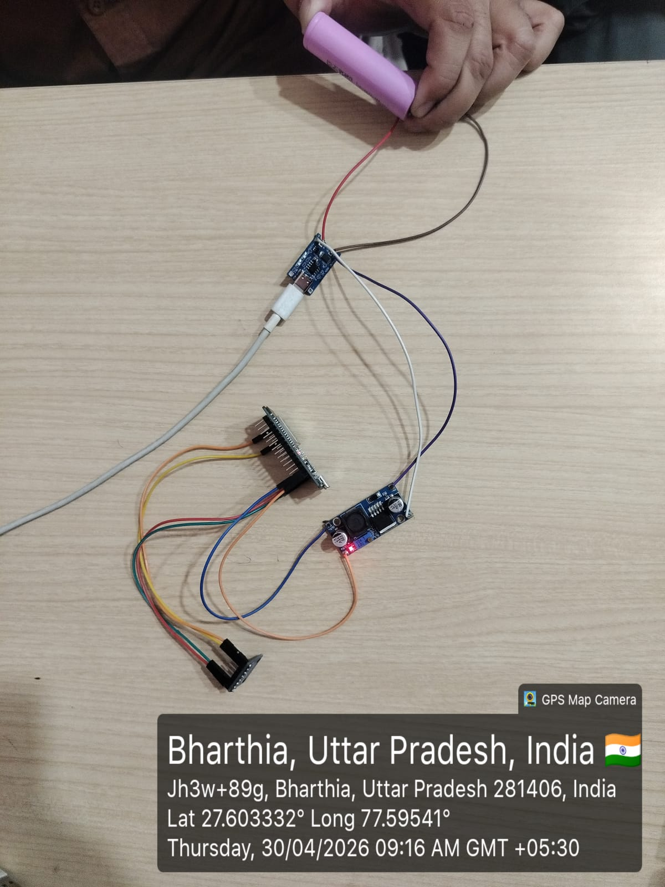
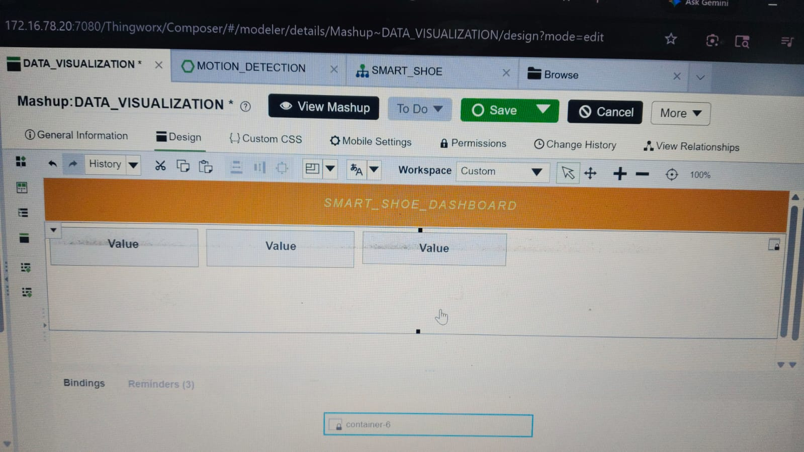
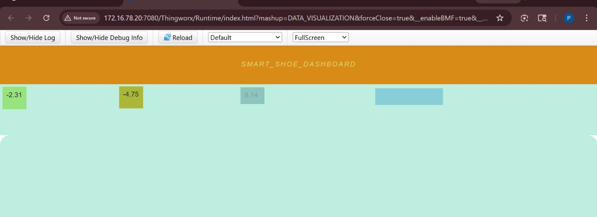

# 🚀 Smart Motion Detection Shoe using IoT

> A wearable IoT-based system that monitors human motion in real time and detects inactivity using an accelerometer and cloud-based analytics.

---

## 📋 Table of Contents

- [Overview](#-overview)
- [Problem Statement](#-problem-statement)
- [Solution](#-solution)
- [System Architecture](#-system-architecture)
- [Hardware Components](#-hardware-components)
- [Circuit Connections](#-circuit-connections)
- [Project Structure](#-project-structure)
- [How It Works](#-how-it-works)
- [Key Features](#-key-features)
- [Technical Details](#-technical-details)
- [Future Enhancements](#-future-enhancements)
- [Getting Started](#-getting-started)
- [Tech Stack](#-tech-stack)
- [Security Note](#-security-note)
- [Conclusion](#-conclusion)

---

## 📌 Overview

This project implements a **smart motion detection shoe** system designed for industrial safety and elderly care applications. The system continuously monitors motion data using an ADXL345 accelerometer interfaced with an ESP32 microcontroller, processes the data, and transmits it to the ThingWorx IoT platform for real-time analysis and alerting.

---

## 🎯 Problem Statement

In environments like **industrial workplaces** or **elderly care facilities**, prolonged inactivity can indicate:

- ⚠️ Fatigue or exhaustion
- 🏥 Injury or medical emergency
- 🔒 Unsafe conditions or accidents

Traditional manual monitoring is:
- ❌ Time-consuming and inefficient
- ❌ Not scalable across large areas
- ❌ Prone to human error and delays

---

## 💡 Solution

This IoT-based solution provides:

1. **Continuous Motion Monitoring** - Real-time tracking using ADXL345 3-axis accelerometer
2. **Wireless Data Transmission** - ESP32 sends data via WiFi to ThingWorx cloud
3. **Automated Inactivity Detection** - Cloud logic triggers alerts when no movement is detected for >30 seconds
4. **Live Dashboard** - Visual representation of motion data and alerts

---

## 🏗️ System Architecture

`
┌─────────────────┐     ┌─────────────┐     ┌──────────────┐     ┌─────────────┐
│   ADXL345       │────▶│    ESP32    │────▶│    WiFi      │────▶│ ThingWorx   │
│  Accelerometer  │     │  Microcontroller │     │   Network   │     │   Platform  │
└─────────────────┘     └─────────────┘     └──────────────┘     └─────────────┘
        │                                                                    │
        │                                                            ┌───────▼───────┐
        │                                                            │  Dashboard    │
        │                                                            │  + Alerts     │
        │                                                            └───────────────┘
`

### Data Flow:
1. **Sensor** → ADXL345 reads X, Y, Z acceleration values
2. **Process** → ESP32 collects and formats sensor data
3. **Transmit** → HTTP PUT requests send data every 2 seconds
4. **Analyze** → ThingWorx cloud logic compares current vs previous values
5. **Alert** → If no significant movement for >30 seconds → trigger alert

---

## 🔧 Hardware Components

| Component | Description | Quantity |
|-----------|-------------|----------|
| ESP32 DevKit V1 | Main microcontroller with WiFi/Bluetooth | 1 |
| ADXL345 | 3-axis digital accelerometer (±2g to ±16g) | 1 |
| TP4056 | USB Li-ion battery charging module | 1 |
| LM2596 | Step-down DC-DC converter (5V to 3.3V) | 1 |
| 18650 | Li-ion battery (3.7V, 2600mAh) | 1 |
| Jumper Wires | Connection wires | As needed |

---

## 🔌 Circuit Connections

### ADXL345 to ESP32

| ADXL345 Pin | ESP32 Pin | Description |
|-------------|-----------|-------------|
| VCC | 3.3V | Power supply |
| GND | GND | Ground |
| SDA | GPIO 21 | I2C Data (SDA) |
| SCL | GPIO 22 | I2C Clock (SCL) |

### Power Circuit

`
18650 Battery (3.7V) → TP4056 (Charging) → LM2596 (5V Output) → ESP32 (5V) → AMS1117 (3.3V) → ADXL345
`

---

## 📂 Project Structure

`
smart-motion-detection-shoe-iot/
├── README.md                    # Project documentation
├── LICENSE                      # MIT License
│
├── code/                        # Firmware source code
│   └── motion_sensor_esp32.ino  # ESP32 Arduino sketch
│
├── cloud/                       # Cloud logic & integration
│   └── motion_detection_logic.js  # ThingWorx subscription
│
├── circuit/                     # Circuit diagrams
│   └── circuit_diagram.png              # Hardware wiring diagram
│
├── images/                      # Project images
│   ├── hardware.jpg            # Hardware setup photo
│   ├── dashboard1.png          # ThingWorx dashboard view 1
│   └── dashboard2.png          # ThingWorx dashboard view 2
│
└── docs/                        # Documentation files
    └── SmartMotionDetectionShoe_Final.pptx  # Project presentation
`

---

## ⚡ How It Works

### Step 1: Motion Sensing
- The ADXL345 accelerometer continuously measures acceleration in X, Y, and Z axes
- Range: ±2g (configurable to ±16g for higher sensitivity)
- Sampling rate: 100Hz (configurable)

### Step 2: Data Processing
- ESP32 reads raw sensor data via I2C communication
- Data is formatted with timestamps and device ID
- Built-in processing filters noise and stabilizes readings

### Step 3: Cloud Transmission
- ESP32 connects to WiFi network
- HTTP PUT requests send JSON payload to ThingWorx every 2 seconds
- Payload includes: device ID, X/Y/Z values, timestamp, battery level

### Step 4: Cloud Analysis
- ThingWorx receives data and stores in data streams
- Subscription logic compares current acceleration with previous values
- Calculates motion delta: |current - previous|

### Step 5: Alert Generation
- If motion delta < threshold for >30 seconds → inactivity detected
- Alert triggered and displayed on dashboard
- Optional: Email/SMS notification to supervisors

---

## ✨ Key Features

| Feature | Description |
|---------|-------------|
| 🔄 Real-time Monitoring | Continuous motion tracking with 2-second updates |
| ☁️ Cloud Integration | Seamless data transmission to ThingWorx platform |
| ⚡ Automated Alerts | Instant notification on inactivity detection |
| 📊 Live Dashboard | Visual analytics and historical data trends |
| 🔋 Battery Powered | Portable with 18650 Li-ion battery |
| 📶 Wireless | WiFi-enabled for flexible deployment |
| 🔒 Low Power | Energy-efficient design for extended operation |

---

## 🛠️ Technical Details

### ESP32 Configuration
- **Board**: ESP32 DevKit V1
- **Clock Speed**: 240MHz
- **Flash Size**: 4MB
- **Connectivity**: WiFi 802.11 b/g/n

### ADXL345 Specifications
- **Interface**: I2C
- **I2C Address**: 0x53 (7-bit)
- **Resolution**: 10-bit (13-bit mode available)
- **Measurement Range**: ±2g, ±4g, ±8g, ±16g
- **Data Rate**: 100Hz to 3.2kHz

### ThingWorx Integration
- **Protocol**: HTTP REST API
- **Method**: PUT
- **Data Format**: JSON
- **Update Interval**: 2 seconds

---

## 🚀 Future Enhancements

- **Fall Detection** - Advanced motion pattern analysis to detect falls
- **Mobile App** - Native iOS/Android apps for real-time alerts
- **GPS Tracking** - Add location services for outdoor workers
- **Heart Rate Monitor** - Integrate PPG sensor for vital signs
- **Multi-user Support** - Monitor multiple workers simultaneously
- **Edge Computing** - Local ML models for faster response
- **Power Optimization** - Using deep sleep mode for battery efficiency
- **Compact PCB Design** - Wearable integration for shoe mounting

---

## 📖 Getting Started

### Prerequisites
- Arduino IDE with ESP32 board support
- ThingWorx account (trial available)
- Basic electronics knowledge

### Steps
1. **Clone the repository**
   `ash
   git clone https://github.com/your-repo/smart-motion-detection-shoe-iot.git
   `

2. **Configure ESP32**
   - Open code/motion_sensor_esp32.ino in Arduino IDE
   - Update WiFi credentials and ThingWorx API keys

3. **Setup ThingWorx**
   - Create ThingWorx thing with properties: X, Y, Z, motionDelta
   - Import cloud logic from cloud/motion_detection_logic.js.js

4. **Build Circuit**
   - Follow circuit connections table
   - Ensure proper voltage levels (3.3V for sensor)

5. **Upload Code**
   - Select ESP32 board and port
   - Upload the sketch

6. **Monitor**
   - View data on ThingWorx dashboard
   - Configure alerts as needed

---

## 🧑‍💻 Tech Stack

| Technology | Purpose |
|------------|---------|
| Embedded C (Arduino) | Firmware development |
| ESP32 | WiFi-enabled microcontroller |
| I2C Communication | Sensor interface |
| REST API (HTTP PUT) | Cloud data transmission |
| ThingWorx IoT Platform | Cloud analytics & dashboard |

---

## ⚠️ Security Note

Sensitive information such as WiFi credentials and API keys have been removed from the code before uploading to GitHub. Please add your own credentials before deploying.

---

## 💡 Conclusion

This project demonstrates how IoT can be used to build real-time monitoring systems for safety, health, and activity tracking using affordable and scalable hardware. The combination of ESP32 and ADXL345 provides a powerful yet cost-effective solution for wearable motion detection applications.

---

## 📸 Project Demo

### Hardware Setup

### Dashboard Output

---

## 🤝 Contributing

Contributions are welcome! Please feel free to submit a Pull Request.

---

## 📝 License

This project is licensed under the **MIT License** - see the [LICENSE](LICENSE) file for details.

---

## 👤 Author

- **Your Name** - [GitHub](https://github.com/yourusername)

---

## 🙏 Acknowledgments

- ThingWorx documentation
- ESP32 community
- ADXL345 sensor documentation

---

  ⭐ If you like this project, feel free to star the repository and share your feedback!

  Built with ❤️ for IoT Innovation

